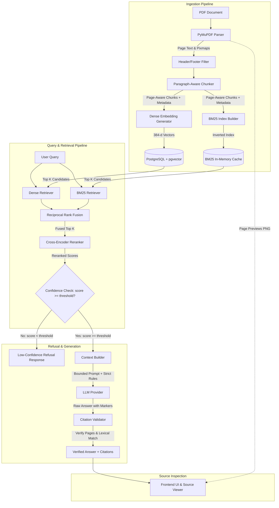

# CiteRAG Architecture Specification

CiteRAG is a precision document question-answering architecture built to guarantee factual grounding and eliminate hallucinations. This document details the component boundaries, data representations, algorithms, and design trade-offs.

---

## System Architecture Diagram



---

## Detailed Component Specifications

### 1. PDF Parser (`PyMuPDF / fitz`)
- **Role**: Extract textual content, structural bounding blocks, and render high-resolution raster previews for every page.
- **Page Preservation**: Page numbers are strictly 1-indexed and permanently bound to every downstream data object.
- **Preview Generation**: Each page is rendered to PNG at 150 DPI via `fitz.Page.get_pixmap(dpi=150)`. These images are stored in `data/previews/<document_id>/page_<num>.png` to enable side-by-side visual document inspection.
- **Header & Footer Filtering**: Repetitive running titles, copyright notices, and standalone page numbers appearing across $>50\%$ of pages are detected and stripped before chunking to prevent duplicate garbage chunks.

---

### 2. Paragraph-Aware Chunker
- **Role**: Dissect document pages into semantic chunks while maintaining sentence integrity and metadata.
- **Strategy**: Rather than naive fixed-character splitting, the chunker groups natural paragraphs (`\n\n`) up to a target size of 1200 characters (~300 tokens) with 200 characters of overlap.
- **Sentence Preservation**: Paragraphs exceeding the chunk limit are split strictly along sentence terminators (`. `, `! `, `? `). Mid-word and mid-sentence splits are prohibited.
- **Metadata Encapsulation**: Each chunk encapsulates:
  ```json
  {
    "chunk_id": "doc123_p4_c8",
    "document_id": "doc123",
    "page_number": 4,
    "chunk_index": 8,
    "text": "...",
    "section": "3.2 Multi-Head Attention",
    "token_count": 284,
    "source_filename": "paper.pdf"
  }
  ```

---

### 3. Dual Indexing: Dense + Sparse (BM25)

#### Dense Index (pgvector)
- **Model**: `sentence-transformers/all-MiniLM-L6-v2` (384-dimensional normalized vectors).
- **Storage**: PostgreSQL table `chunks` with column `embedding vector(384)`.
- **Indexing**: HNSW index (`vector_cosine_ops`) with parameters $m=16, ef_{construction}=64$.
- **Retrieval**: Cosine similarity $= 1 - (embedding \Leftrightarrow query\_vec)$.

#### Sparse Index (BM25Okapi)
- **Model**: Inverted BM25 index over tokenized chunks with term frequency and inverse document frequency saturation.
- **Tokenization**: Regex-based tokenization that preserves alphanumeric identifiers, hyphens, and numeric decimals (`WMT-2014`, `10-K`, `0.0001`, `P100`).
- **Caching**: BM25 index is cached in-memory per document to eliminate re-indexing latency on repeated queries.

---

### 4. Hybrid Fusion: Reciprocal Rank Fusion (RRF)
- **Problem**: Cosine similarity produces bounded scores $[0, 1]$, whereas BM25 produces unbounded scores $[0, \infty)$. Min-max normalization is sensitive to outliers and query-to-query score variations.
- **Solution**: Reciprocal Rank Fusion combines results strictly based on rank:
  $$RRF\_score(d) = \sum_{m \in \{dense, bm25\}} \frac{1}{k + rank_m(d)}$$
  where $k=60$ (the Cormack et al. constant).
- **Benefit**: Scale-invariant, robust across diverse query types, and treats dense and sparse retrieval symmetrically without hyperparameter calibration.

---

### 5. Cross-Encoder Reranker
- **Model**: `cross-encoder/ms-marco-MiniLM-L-6-v2`.
- **Mechanism**: Evaluates full cross-attention between `(query, chunk_text)` rather than computing independent cosine projections.
- **Pipeline**:
  1. Dense + BM25 retrieve top $K=20$ candidates.
  2. RRF merges candidates into an ordered candidate list.
  3. Cross-Encoder evaluates all $K$ candidates and assigns a cross-attention logit score.
  4. Candidates are sorted by logit score descending and pruned to top $N=5$.

---

### 6. Low-Confidence Refusal Engine
- **Failure Mode in Traditional RAG**: Vector search always returns the nearest neighbor, even if the similarity is virtually zero or the document is completely unrelated. The LLM then hallucinates an answer from irrelevant text.
- **CiteRAG Guardrail**:
  - Compares the top cross-encoder logit against a calibrated confidence threshold $\tau = -2.5$.
  - If $score_{top} < \tau$, CiteRAG aborts generation immediately and returns:
    ```
    "I don't know based on the documents available. No sufficiently relevant source was found to answer this question."
    ```
  - Refusal is flagged (`refused: true`) and recorded in system metrics.

---

### 7. Context Builder & LLM Answer Generation
- **Prompt Structure**:
  - Retrieved chunks are formatted into numbered sources with explicit document ID, page number, and chunk ID.
  - Strict system prompt rules enforce:
    1. Grounding exclusively in provided context.
    2. No use of external knowledge.
    3. Required inline bracketed citations (`[Page X]`) for every factual assertion.
    4. Explicit refusal if evidence is insufficient.

---

### 8. Citation Validator
- **Problem**: Large Language Models frequently hallucinate citation markers or cite pages that do not contain the claim.
- **Validation Protocol**:
  1. Scans LLM output for citation markers (`[Page X]`, `[Source X]`).
  2. Verifies that page $X$ was in fact retrieved and supplied in the context.
  3. Extracts the claim sentence and computes lexical / n-gram overlap against the chunks on page $X$.
  4. Extracts the exact supporting snippet within that chunk.
  5. If an LLM cites a page not present in the context, the citation is flagged as hallucinated and removed from the user response.

---

### 9. Source Viewer & Verification UI
- **User Inspection**: End users do not have to trust the LLM. Clicking any citation badge `[Page X]` opens the Source Inspector.
- **Inspection Features**:
  - High-resolution visual PDF page render.
  - Side-by-side extracted text.
  - Highlighted cited snippet.
  - Page-by-page navigation.
